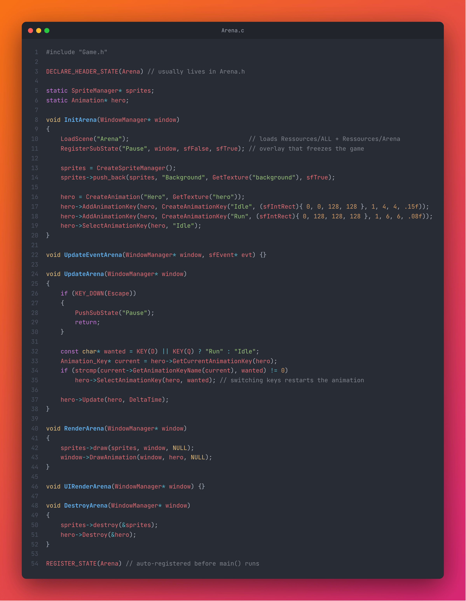
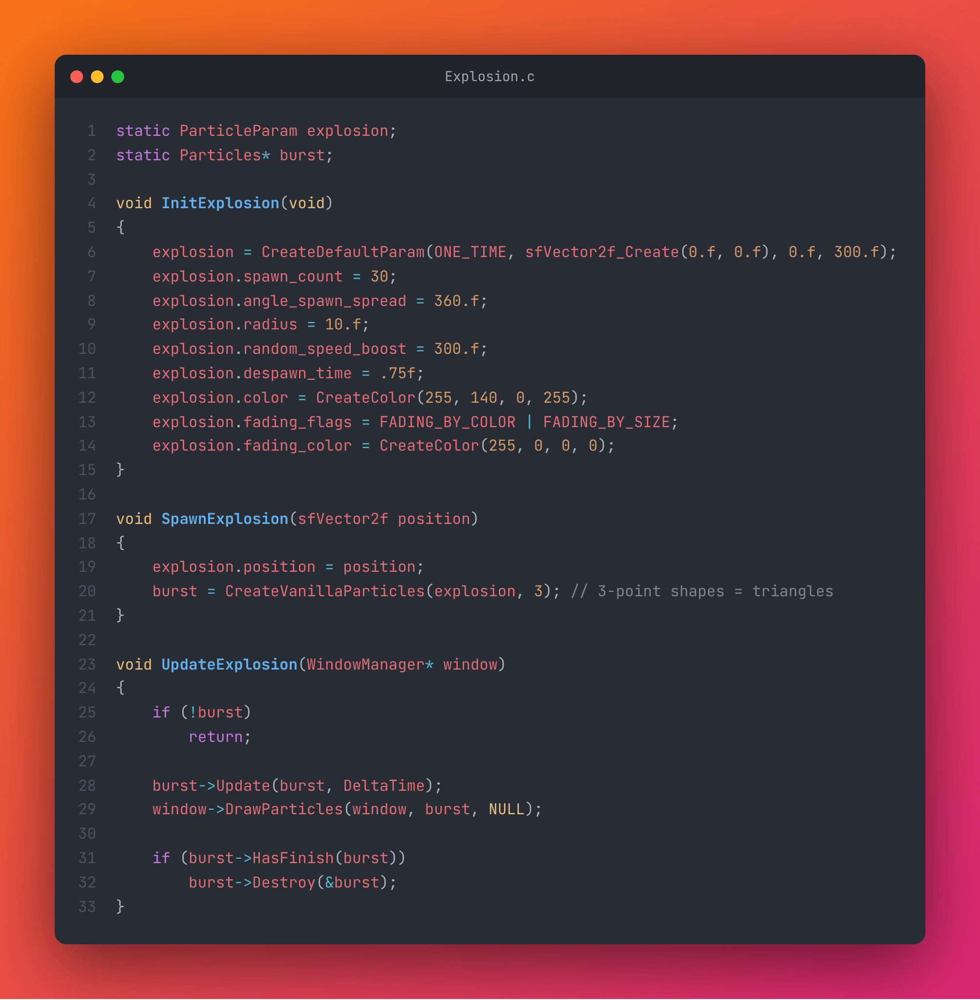

# BreakerEngine

**BreakerEngine** is a 2D game engine written in **C** on top of **CSFML** (the C binding of SFML). It provides a state machine, scene-based resource loading, animations, particles, UI buttons, audio, logging and memory tracking, so you can focus on the game instead of the boilerplate.


<p align="center">
  
  
</p>

The engine is designed to be **ready-to-go for first-year students** of my school: CSFML headers, `.lib` files and sample resources are included in the repository and the project builds directly from the Visual Studio solution, without CMake.

---

## 📑 Table of Contents

- [Features](#-features)
- [Getting Started](#-getting-started)
- [Your First Game](#-your-first-game)
- [Core Concepts](#-core-concepts)
  - [States and sub-states](#states-and-sub-states)
  - [Resources and scenes](#resources-and-scenes)
  - [Window manager and input](#window-manager-and-input)
  - [Sprites and UI](#sprites-and-ui)
  - [Animations](#animations)
  - [Particles](#particles)
  - [Utilities](#utilities)
- [Project Structure](#-project-structure)
- [Documentation](#-documentation)
- [Contributing](#-contributing)
- [License](#-license)

---

## ✨ Features

| Module | What it does |
| --- | --- |
| **State machine** | Main states and stackable sub-states (pause, options…) with a lifecycle `Init / UpdateEvent / Update / Render / UIRender / Destroy`. States register themselves automatically. |
| **Loading screen** | Scenes are loaded while a loading state is displayed, with progress values per resource type. |
| **Resources manager** | Textures, fonts, sounds, musics and movies loaded per scene and fetched by name. |
| **Window manager** | Window creation, fullscreen, timers, volume channels and draw helpers. |
| **Sprite manager** | Named sprite lists drawn in one call. |
| **UI** | Buttons built from sprites/shapes with hover and click states and an update callback. |
| **Animations** | Sprite-sheet animations with multiple keys, reverse/pause/stop-at-last-frame, loadable from `.anim` files. |
| **Particles** | One-shot, timed or infinite emitters, color/size fading, vanilla shapes or textures, loadable from `.part` files. |
| **Viewport** | Camera views with zoom. |
| **Tools** | Input macros, delta time, vector math, colors, random helpers. |
| **Debug** | Categorized logger, memory leak tracker, crash handler. |
| **File system** | Paths, directory iteration and creation. |
| **Threads** | Thread pool with a concurrency limit. |

Containers (`stdList`, `stdVector`, `stdPool`, `stdString`) come from [C_STL](https://github.com/Xanhos/C_STL).

---

## 🚀 Getting Started

### Prerequisites

1. **Windows 10/11 (x64)**
2. **Visual Studio 2019 or later** with the *Desktop development with C++* workload

CSFML 2.6, C_STL, CParser and KSound are already in `include/` and `lib/`.

### Build and run

1. Clone the repository:
   ```bash
   git clone https://github.com/Xanhos/BreakerEngine.git
   ```
2. Open `BreakerEngine.sln` in Visual Studio.
3. Select the **x64** platform (Debug or Release).
4. Build and run: the sample game opens on its main menu.

The executable looks for its resources in `../Ressources` (see `InitResourcesManager` in `Source.c`).

---

## 🎮 Your First Game

### 1. Create a state

A state is a set of six functions named after the state. `DECLARE_HEADER_STATE` declares them and `REGISTER_STATE` registers the state **before `main()` runs**, so the engine can find it by name.

```c
#include "Game.h"

DECLARE_HEADER_STATE(Arena) // usually lives in Arena.h

static SpriteManager* sprites;
static Animation* hero;

void InitArena(WindowManager* window)
{
    LoadScene("Arena");                                 // loads Ressources/ALL + Ressources/Arena
    RegisterSubState("Pause", window, sfFalse, sfTrue); // overlay that freezes the game

    sprites = CreateSpriteManager();
    sprites->push_back(sprites, "Background", GetTexture("background"), sfTrue);

    hero = CreateAnimation("Hero", GetTexture("hero"));
    hero->AddAnimationKey(hero, CreateAnimationKey("Idle", (sfIntRect){ 0, 0, 128, 128 }, 1, 4, 4, .15f));
    hero->AddAnimationKey(hero, CreateAnimationKey("Run", (sfIntRect){ 0, 128, 128, 128 }, 1, 6, 6, .08f));
    hero->SelectAnimationKey(hero, "Idle");
}

void UpdateEventArena(WindowManager* window, sfEvent* evt) {}

void UpdateArena(WindowManager* window)
{
    if (KEY_DOWN(Escape))
    {
        PushSubState("Pause");
        return;
    }

    const char* wanted = KEY(D) || KEY(Q) ? "Run" : "Idle";
    Animation_Key* current = hero->GetCurrentAnimationKey(hero);
    if (strcmp(current->GetAnimationKeyName(current), wanted) != 0)
        hero->SelectAnimationKey(hero, wanted); // switching keys restarts the animation

    hero->Update(hero, DeltaTime);
}

void RenderArena(WindowManager* window)
{
    sprites->draw(sprites, window, NULL);
    window->DrawAnimation(window, hero, NULL);
}

void UIRenderArena(WindowManager* window) {}

void DestroyArena(WindowManager* window)
{
    sprites->destroy(&sprites);
    hero->Destroy(&hero);
}

REGISTER_STATE(Arena) // auto-registered before main() runs
```

> Need a placeholder state? `DECLARE_BLANK_STATE(Name)` generates the six functions with empty bodies.

### 2. Start the game

```c
#include "Game.h"
#include "LoadingState.h"

int main(void)
{
    InitResourcesManager("../Ressources");

    WindowManager* window = CreateWindowManager(1920, 1080, "My Game", sfDefaultStyle, NULL);
    StartGame(window, "Arena", "Loading", &ResetLoadingState);
    return 0;
}
```

`StartGame` runs the main loop until `EndGame(window)` is called: it starts on `"Arena"` and shows the `"Loading"` state while scene resources are loaded.

---

## 🧩 Core Concepts

### States and sub-states

| Function | Description |
| --- | --- |
| `ChangeMainState("Name")` | Destroys the current main state and switches to another one. |
| `RegisterSubState("Name", window, updateBelow, displayBelow)` | Declares a sub-state and whether the state below keeps updating / rendering. |
| `PushSubState("Name")` / `PopSubState()` | Opens / closes a sub-state on top of the current state (pause menu, options…). |
| `GetCurrentState()` | Name of the active state. |
| `EndGame(window)` | Leaves the main loop. |

Each frame the engine calls `UpdateEvent` for every SFML event, then `Update`, `Render` (world) and `UIRender` (interface, drawn on top).

### Resources and scenes

Resources are organized by **scene** folders. `ALL` is loaded once at startup, a scene folder is loaded by `LoadScene("Scene")`:

```text
Ressources/
├── ALL/                      # Always loaded
│   ├── Textures/             # placeholder.png is required
│   ├── Fonts/                # placeholder.ttf is required
│   ├── Sounds/               # placeholder.wav is required
│   ├── Musics/               # placeholder.ogg is required
│   └── Movies/
└── Game/                     # Loaded with LoadScene("Game")
    └── Textures/
        └── BACKGROUND.png    # -> GetTexture("background")
```

Resources are fetched by their **lower-case file name without extension**: `GetTexture("background")`, `GetFont("placeholder")`, `GetSound(...)`, `GetMusic(...)`. A missing name returns the placeholder instead of crashing.

### Window manager and input

```c
WindowManager* window = CreateWindowManager(1920, 1080, "My Game", sfDefaultStyle, NULL);

window->DrawSprite(window, sprite, NULL);
window->DrawText(window, text, NULL);
window->DrawAnimation(window, animation, NULL);
window->DrawParticles(window, particles, NULL);

if (window->GetTimer(window) > .2f) { /* debounce */ window->ResetTimer(window); }
window->AddNewSound(window, "Music", 50.f);   // volume channel
```

Input and time helpers from `Tools.h`:

| Macro | Description |
| --- | --- |
| `KEY(D)` / `MOUSE(Left)` | Key / button held. |
| `KEY_DOWN(Space)` / `MOUSE_DOWN(Left)` | Pressed this frame. |
| `KEY_UP(Escape)` / `MOUSE_UP(Right)` | Released this frame. |
| `DeltaTime` | Seconds elapsed since the last frame. |
| `sfVector2f_Create`, `AddVector2f`, `MultiplyVector2f`, `CreateColor`, `rand_float`… | Math and helpers. |

### Sprites and UI

```c
SpriteManager* sprites = CreateSpriteManager();
sfSprite* title = sprites->push_back(sprites, "Title", GetTexture("menu_spritesheet"), sfTrue);
sfSprite_setTextureRect(title, (sfIntRect){ 0, 6259, 563, 468 });

UIObjectManager* ui = CreateUIObjectManager();
UIObject* play = ui->push_back(ui, CreateUIObjectFromSprite(NULL, "Play", sfMouseLeft, sfKeyUnknown));
play->setTexture(play, GetTexture("menu_spritesheet"), sfFalse);
play->setTextureRect(play, (sfIntRect){ 0, 14004, 358, 142 });
play->setPosition(play, sfVector2f_Create(781, 520));
play->setUpdateFunction(play, &OnButtonUpdate);   // reads object->isHover / object->isClicked

// In Update:   ui->update(ui, window);
// In UIRender: sprites->draw(sprites, window, NULL); ui->draw(ui, window, NULL);
```

Buttons can also be built from rectangles (`CreateUIObjectFromRectangle`) or circles (`CreateUIObjectFromCircleShape`). See `Menu.c` for a complete menu.

### Animations

```c
Animation* player = CreateAnimation("Player", GetTexture("player"));
player->AddAnimationKey(player, CreateAnimationKey("Damage", (sfIntRect){ 0, 6125, 228, 130 }, 1, 3, 3, .08f));
player->SelectAnimationKey(player, "Damage");
player->SetAnimationParameters(player, sfFalse /*paused*/, sfTrue /*reverse*/, sfFalse /*stop at last frame*/);

player->Update(player, DeltaTime);
window->DrawAnimation(window, player, NULL);
```

`CreateAnimationKey(name, firstFrameRect, lines, framesPerLine, totalFrames, frameTime)` describes one animation inside a sprite sheet. Animations can be duplicated with `CopyAnimation` or loaded from a `.anim` file with `CreateAnimationFromFile`. For a single looping strip, `CreateSimpleAnim` is lighter.

### Particles

```c
ParticleParam explosion = CreateDefaultParam(ONE_TIME, sfVector2f_Create(0.f, 0.f), 0.f, 300.f);
explosion.spawn_count = 30;
explosion.angle_spawn_spread = 360.f;
explosion.color = CreateColor(255, 140, 0, 255);
explosion.fading_flags = FADING_BY_COLOR | FADING_BY_SIZE;
explosion.fading_color = CreateColor(255, 0, 0, 0);

Particles* burst = CreateVanillaParticles(explosion, 3);   // 3-point shapes = triangles

// Each frame
burst->Update(burst, DeltaTime);
window->DrawParticles(window, burst, NULL);
if (burst->HasFinish(burst))
    burst->Destroy(&burst);
```

| Type | Behaviour |
| --- | --- |
| `ONE_TIME` | Spawns once (explosions, impacts). |
| `LIFE_TIME` | Emits during `life_time` seconds. |
| `ALWAYS` | Emits forever (fire, smoke). |

Use `CreateTextureParticles` for textured particles and `LoadParticlesFromFile` to load a `.part` preset.

### Utilities

| Module | Example |
| --- | --- |
| **Logger** (`Logger.h`) | `DEFINE_LOG_CATEGORY(LogGame)` then `LOG(LogGame, WARNING, "hp = %d", hp);` (set `LOG_ACTIVE` to `1` to enable, logs go to `../Logs/LogReport.log`). |
| **Memory tracker** (`MemoryManagement.h`) | `calloc_d(type, count)` / `free_d(ptr)` and `ReportLeaks()` to list allocations that were never freed. |
| **Crash handler** (`CrashHandler.h`) | `SetCustomExceptionHandler()` prints a crash report with the call stack (function, file, line) on unhandled exceptions. |
| **File system** (`FileSystem.h`) | `fs_create_path`, `fs_create_directory`, `fs_remove`, `FOR_EACH_ITERATOR(path, files, ...)`. |
| **Threads** (`ThreadManager.h`) | `CreateThreadManager(limit)` then `AddNewThread(manager, func, data, copyData, dataSize)`. |
| **Viewport** (`Viewport.h`) | `CreateViewport(windowSize, size, port)`, `Zoom` / `Dezoom`. |

---

## 📂 Project Structure

```text
BreakerEngine/
├── BreakerEngine/              # Engine + sample game sources
│   ├── Game.c/.h  State.c/.h   # Main loop and state machine
│   ├── WindowManager  Viewport  ResourcesManager  TextureManager  FontManager
│   ├── AudioManager  MovieManager  SpriteManager  UI  Animation  Particles
│   ├── Tools  Logger  MemoryManagement  CrashHandler  FileSystem  ThreadManager
│   ├── LoadingState  Menu  Option  Pause  InGame       # Sample states
│   ├── Player  Enemy  Projectile                       # Sample gameplay
│   └── Source.c                # main()
├── Doc/                        # Doxygen documentation (HTML + LaTeX)
├── Ressources/                 # Sample resources (ALL + Game scene)
├── include/                    # CSFML, C_STL, CParser and KSound headers
├── lib/                        # Pre-built libraries
├── BreakerEngine.sln
└── LICENSE
```

---

## 📖 Documentation

The full API reference is generated with Doxygen in [`Doc/html`](Doc/html/index.html): open `Doc/html/index.html` in a browser after cloning. Every public function is documented in its header.

Useful external resources:

- [Official CSFML repository](https://github.com/SFML/CSFML)
- [SFML tutorials](https://www.sfml-dev.org/tutorials/) (C++, but the concepts apply)
- [CSFML API reference](https://www.sfml-dev.org/documentation/)

---

## 🤝 Contributing

Contributions are welcome:

1. Fork the repository and create a feature branch.
2. Keep functions focused, comment complex logic and use descriptive names.
3. Test on Windows x64 and check for memory leaks (`ReportLeaks()`).
4. Open a pull request with a clear description.

Bugs and questions: [GitHub Issues](https://github.com/Xanhos/BreakerEngine/issues).

---

## 📝 License

BreakerEngine is licensed under the **MIT License**. Copyright (c) 2025 Yann Grallan.
